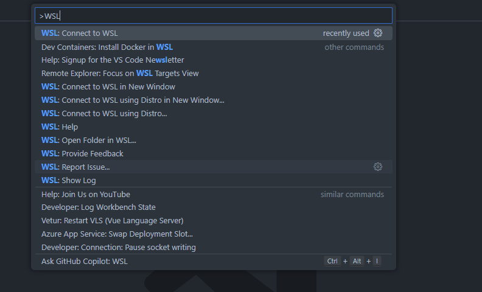
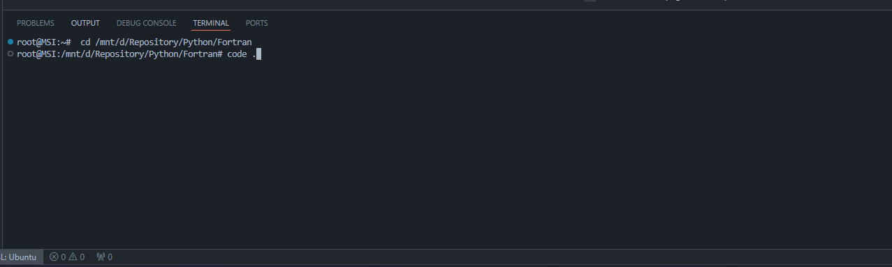
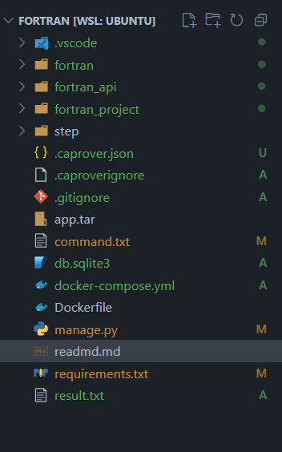
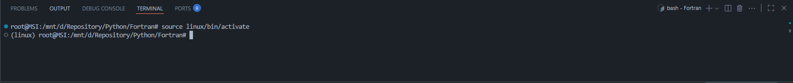

### Project Setup (Project name: Django restapi(Python) using fortran)

Calculations are implemented in **Fortran**, and a **Python** application is used to invoke these computations.

🛠️ Tech Stack
- Fortran
- Django RestAPI framework
- Swagger
- WSL

## 🐧 WSL SETUP

1. Open WSL in VS code using ctrl + shift + P:

<div>
    
<div>

2. Open the terminal and type the following command: <b>cd /mnt/d/Repository/Python/Fortran</b> (which is equivalent to <b>cd D:\Repository\Python\Fortran</b> on Windows). Then, type <b>code .</b> to open the project.

<div>
    
<div>

3. After running the <b>code .</b> command, the project should open in VS Code. You’ll see the project’s file name in the editor, indicating that it was successfully opened in WSL..

<div>
    
<div>

<br />

## Optional (If you want to change your system environment)

- Once you've successfully switched the terminal to Linux, type the command below to create a new environment folder. (This will allow you to run your application and install it in a separate environment).
    ```sh
     python -m venv <filename> or python3 -m venv <filename>
    ```
- Once the environment has been successfully added, activate it using the command below. <b>
source linux/bin/activate</b>. Then you will have a tag ex: <b>(linux) root@MSI:/mnt/d/Repository/Python/Fortran#</b>

<div style="text-align: center;">
    
</div>

## 📦 Install the package and run the application

- Type the command below to install the required libraries for this project.
    ```sh
     pip install -r requirements.txt
    ```
- Type the command below to run the application and access it http://127.0.0.1:8000/api/docs/.

    ```sh
     python3 manage.py runserver or python manage.py runserver
    ```

## 🐳 Docker Setup

1. Clone the repository:
   ```sh
   git clone https://gitlab.cleverativity.com/cleverativity/thermokey/api-dualflow.git
   ```
2. Open Terminal (Run the command below)
   ```sh
    docker-compose build
   ```
3. Once the application is done to build (Run the command below to run the application) and you can access the API in http://127.0.0.1:8000/api/docs/
   ```sh
    docker-compose up
   ```
